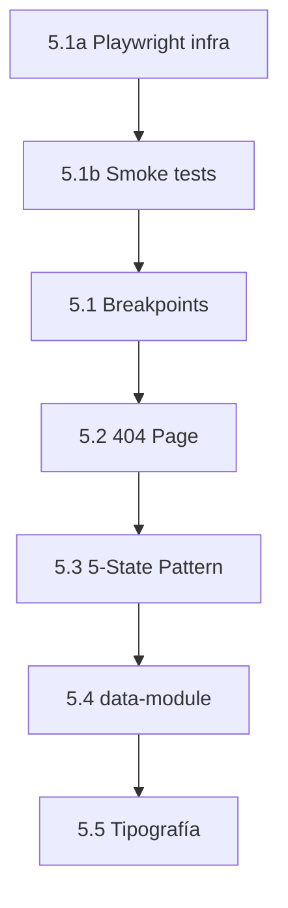

# Gate 5 — Plan de Implementación

**Fecha:** 2026-02-27
**Aprobador:** Daniel
**Estado:** PENDIENTE — no ejecutar sin aprobación explícita de Daniel.
**Regla:** Cada paso se hace en 1 commit aislado. Si falla verificación, rollback antes de avanzar al siguiente.

---

## Orden de implementación

### 5.1a — Playwright infra (instalar)

**Qué:** Instalar `@playwright/test` como devDependency en `/webapp`. No crear tests aún — solo infra.

**Comando:** `cd webapp && npm install -D @playwright/test && npx playwright install --with-deps chromium`

**Verificación:** `npx playwright --version` retorna versión sin error.

**Rollback:** `git revert HEAD` + `npm install`

---

### 5.1b — Playwright smoke tests (mínimos)

**Qué:** Crear 1–2 tests básicos para validar que Playwright funciona con el dev server:
1. Test: abrir `/` → confirmar que el título de la página existe
2. Test: abrir `/ruta-inexistente` → confirmar que NO crashea y que renderiza algún contenido (HTTP 200 en SPA)

> **Nota:** El assert de copy/CTAs de la pantalla 404 se agrega en Gate 5.2.

**Archivos:** `webapp/tests/smoke.spec.ts`, `webapp/playwright.config.ts`

**Verificación:** `cd webapp && npx playwright test` pasa sin errores.

**Rollback:** `git revert HEAD`

> **Nota:** 5.1a + 5.1b son prerrequisitos de 5.2+. Sin Playwright, toda verificación visual es manual.

---

### 5.1 — Breakpoints (ADR-0003, Opción B)

**Qué:**
1. Agregar `xs: '360px'` y `sm640: '640px'` a `tailwind.config.ts`
2. Buscar y renombrar usos existentes `sm:` → `sm640:` (estimación: ~1 archivo)
3. Override `sm: '480px'`

**Archivos afectados:** `webapp/tailwind.config.ts`, archivos con clases `sm:*`

**Riesgos:**
- Breaking change: cualquier clase `sm:` existente cambia de 640px a 480px
- Si hay más usos de `sm:` de los estimados, la migración toma más tiempo

**Verificación:**
- (opcional/best-effort) (desde `/webapp`) `npx tailwindcss --content ./src/**/*.tsx --no-minify | grep "480px"` (confirmar override)
- Golden screenshots: desktop + mobile (360px) para pantallas con Estado=Completo
- Build OK: `npm run build` sin errores

**Rollback:** `git revert HEAD` (1 commit aislado)

---

### 5.2 — Pantalla 404 (ADR-0004)

**Qué:**
1. Crear componente 404 dentro de AppLayout (Smart Dock visible)
2. Agregar ruta catch-all `path="*"` en el router entrypoint
3. Implementar copy aprobado + CTAs (Dashboard + explorar módulos)

**Archivos afectados:** Router entrypoint, nuevo componente 404

**Riesgos:**
- CTA "explorar módulos" puede requerir guard si módulos no son accesibles sin login
- Ruta `*` debe ser la última en el árbol de rutas

**Verificación:**
- E2E manual: navegar a `/ruta-inexistente` → ver pantalla 404 con Smart Dock
- Golden screenshots: capturar si se decide que 404 es golden (requiere ADR separado)
- Build OK: `npm run build` sin errores

**Rollback:** `git revert HEAD`

---

### 5.3 — 5-State Pattern (ADR-0006)

**Qué:**
1. Crear componentes reutilizables: `<LoadingSkeleton>`, `<EmptyState>`, `<ErrorState>`, `<OfflineState>`, `<SuccessConfirmation>`
2. Capturar snapshots UI-kit en `tests/visual/ui-kit/`
3. Integrar en 1–2 pantallas golden (Dashboard, Perfil) como prueba de concepto
4. Actualizar golden screenshots si cambia el layout

**Archivos afectados:** Nuevos componentes en `webapp/src/`, pantallas Dashboard y Perfil

**Riesgos:**
- Skeleton layout debe coincidir con layout real para evitar CLS
- ~8–12h implementación (estimación)
- Cambio en golden screenshots existentes (Dashboard, Perfil)

**Verificación:**
- UI-kit snapshots manuales (hasta que exista suite Playwright UI-kit): snapshot de cada componente aislado
- Suite UI-kit Playwright se crea en Gate 5.3a (infra)
- Golden screenshots: actualizar si skeleton/empty cambian layout de pantalla con Estado=Completo
- E2E manual: forzar estados (disconnect network, vaciar datos, provocar error)
- Build OK

**Rollback:** `git revert HEAD` (componentes son aditivos, no rompen existente)

---

### 5.4 — data-module (ADR-0002)

**Qué:**
1. Agregar atributo `data-module` al contenedor raíz de cada módulo (basado en ruta activa)
2. Implementar tokens CSS: `--module-accent` y `--module-bg` por módulo
3. Valor `unknown` = tokens default (sin acento)

**Archivos afectados:** Layout/wrapper de módulos, CSS/tokens, router mapping

**Riesgos:**
- Si el layout de algún módulo no tiene contenedor claro, requiere refactor menor
- 6 valores × 2 tokens = 12 definiciones CSS nuevas

**Verificación:**
- Visual regression: cada módulo muestra su atmósfera cromática correcta
- DevTools: inspeccionar `data-module` attribute en cada ruta
- Golden screenshots: recapturar Dashboard (que pertenece a `mi-civicum`)
- Build OK

**Rollback:** `git revert HEAD`

---

### 5.5 — Tipografía (ADR-0007) — al final

**Qué:**
1. Instalar Nunito Sans + IBM Plex Sans + IBM Plex Mono (Google Fonts o self-hosted)
2. Configurar font-face con tier system:
   - HIGH: 3 familias completas
   - MEDIUM: Nunito Sans + IBM Plex Sans
   - LOW: `system-ui` fallback
3. Actualizar Tailwind `fontFamily` en config
4. Remover Inter

**Archivos afectados:** `webapp/tailwind.config.ts`, `index.html` o CSS global, fuentes

**Riesgos:**
- Impacto en bundle size — **MUST** validar contra presupuesto UI-STP-008 (≤800KB)
- Cambio visual en TODA la app (todas las pantallas cambian tipografía)
- Requiere recapturar TODOS los golden screenshots

**Verificación:**
- Lighthouse: medir bundle total post-fonts; confirmar ≤800KB critical pack
- Visual regression: comparar golden screenshots pre/post cambio
- Performance: cumplir CWV Tier LOW (UI-STP-007): FCP≤2.0s, LCP≤4.0s, TTI≤5.0s, CLS≤0.2
- Build OK

**Rollback:** `git revert HEAD` + restaurar Inter en config

---

## Dependencias entre pasos

- **5.1a → 5.1b:** Instalar Playwright antes de crear smoke tests
- **5.1b → 5.1:** Smoke tests validan que el dev server responde antes de tocar breakpoints
- **5.1 → 5.2:** La pantalla 404 debe usar los breakpoints correctos
- **5.2 → 5.3:** Los estados (loading/error) aplican a todas las pantallas incluyendo 404
- **5.3 → 5.4:** data-module afecta visual regression; implementar DESPUÉS de que los estados estén estabilizados
- **5.4 → 5.5:** Tipografía es el cambio más impactante visualmente; va al final cuando todo lo demás está estable

## Infraestructura requerida (GAPs)

| GAP | Descripción | Impacto | Recomendación |
|-----|------------|---------|---------------|
| Sin Playwright | No hay test runner visual ni E2E | ALTO | Instalar `@playwright/test` como primer paso de Gate 5.1 (antes de breakpoints) |
| Sin CI visual | No hay pipeline para comparar screenshots | MEDIO | Configurar en Época 2+ (manual es aceptable para Época 1) |
| Sin Storybook | No hay catálogo de componentes aislados | BAJO | Opcional; UI-kit screenshots manuales son suficientes para Época 1 |
