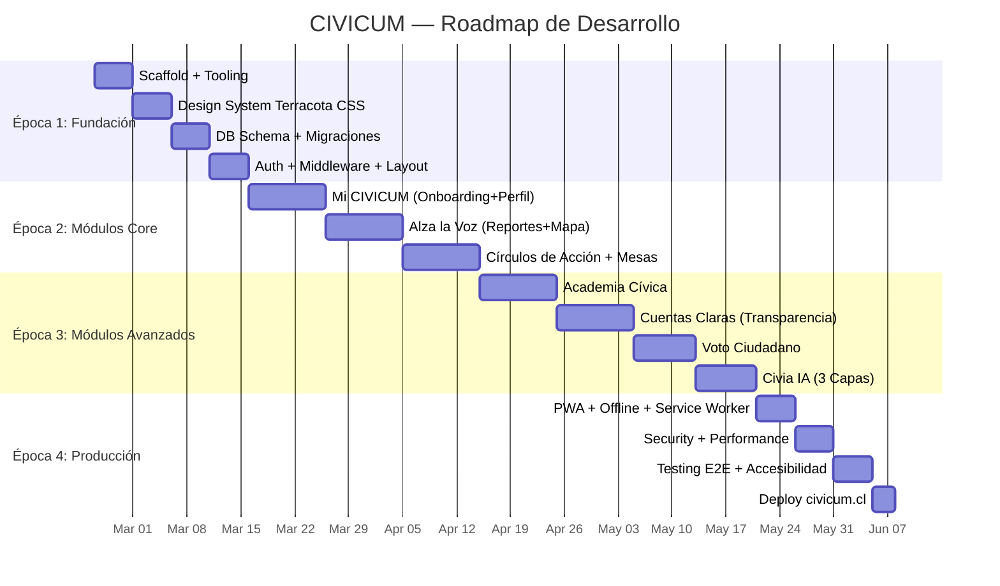

# 🏗️ CIVICUM — Plan de Desarrollo Definitivo (Zero → Producción)

**Dominio:** `civicum.cl`  
**Licencia:** AGPL-3.0  
**Estimación total:** ~1,125h técnicas + 385h contenido = ~1,510h  
**Fuentes integradas:** 53 directorios de docs, ~700 archivos, 17 knowledge-base docs, 47 decisiones F-01→F-47, 145 squads auditados

> [!IMPORTANT]
> Este plan fue generado tras la revisión exhaustiva de **toda** la documentación existente en `docs/`. Cada decisión técnica está respaldada por los documentos canónicos del proyecto.

---

## Stack Tecnológico Confirmado (F-43: Zero-Cost)

| Capa | Tecnología | Doc Fuente |
|------|-----------|------------|
| **Frontend** | React 18 + TypeScript (strict) | Arq. Técnica §1.2.1 |
| **UI Components** | shadcn/ui + Radix UI primitives | Arq. Técnica §1.2.2, Design System §5 |
| **Estilos** | Tailwind CSS v3.4+ (paleta Terracota custom) | Design System Terracota §1-2 |
| **Estado cliente** | Zustand v4 (persist) + TanStack Query v5 | Arq. Técnica §1.2.3 |
| **Service Workers** | Workbox v7+ | Arq. Técnica §1.2.4 |
| **API Framework** | Hono v4 + tRPC v11 | Arq. Técnica §1.3.2 |
| **ORM** | Drizzle ORM (TypeScript-first) | Arq. Técnica §1.3.3 |
| **Base de datos** | Neon PostgreSQL 15 + PostGIS | Arq. Técnica §1.3.4 |
| **Hosting** | Vercel Edge Functions | Arq. Técnica §1.3.1 |
| **CDN/WAF** | Cloudflare Free (CDN + WAF + DDoS) | Arq. Técnica §1.1.3 |
| **Storage** | Cloudflare R2 (10GB free, S3-compatible) | Arq. Técnica §1.1.4 |
| **CI/CD** | GitHub Actions (ilimitado repo público) | Arq. Técnica §1.1.5 |
| **IA Local** | WebLLM (Llama 3 8B) + TensorFlow.js | Arq. Técnica §1.4.1-2 |
| **IA Cloud** | Cloudflare Workers AI (fallback) | Arq. Técnica §1.4.3 |
| **Voz** | Web Speech API (nativa) | Arq. Técnica §1.4.4 |
| **Tests** | Vitest + Playwright + jest-axe | Arq. Técnica §1.5 |
| **Tipografía** | Nunito Sans + IBM Plex Sans + IBM Plex Mono | Design System §2 |
| **Iconos** | Lucide React (stroke 2px) | UI/UX Definitivo §4 |
| **Gráficos** | Recharts / D3.js | Módulos MVP §2.5 |
| **Mapas** | Leaflet + OpenStreetMap + Supercluster.js | Arq. Técnica §1.3.4.1 |
| **Package Manager** | PNPM | Decisión auditada Squad 311 |

---

## Base de Datos — 10+ Tablas Core (Arq. Técnica §2.2)

| Tabla | Módulo | Campos Clave |
|-------|--------|-------------|
| `profiles` | Mi CIVICUM | uuid, email, rut_hash, commune_id, verification_level(0-4), karma_points, karma_cap, role |
| `community_reports` | Alza la Voz | uuid, author_id, commune_id, title, description, category, location(PostGIS POINT), status, support_count, images[] |
| `authorities` | Cuentas Claras | uuid, full_name, position, position_type, territory_id, political_party, term_start/end |
| `promises` | Cuentas Claras | uuid, authority_id, title, category, source_url, status, progress_percent, evidence(JSONB) |
| `parliamentary_votes` | Voto Ciudadano | uuid, bill_id, bill_title, chamber, result, individual_votes(JSONB) |
| `budget_data` | Cuentas Claras | uuid, territory_id, year, category, budget_initial, executed, source |
| `organization_units` | Círculos de Acción | uuid, name, type(neighborhood/thematic/municipal), commune_id, creator_id, member_count |
| `deliberation_tables` | Mesas | uuid, report_id, org_unit_id, title, objective, tasks(JSONB), participants[] |
| `citizen_votes` | Voto Ciudadano | uuid, user_id, topic_id, vote(for/against/abstain), UNIQUE(user_id,topic_id) |
| `scraper_logs` | Data Pipeline | uuid, source, job_name, status, records_fetched, validation_score |
| `audit_log` | Core/Security | uuid, actor_id, action, target_type, target_id, old_value, new_value (INSERT-only) |
| `communes` | Core | uuid, nombre, codigo_territorial, region_id, boundaries(POLYGON) |

---

## 4 Épocas de Desarrollo (18 Semanas)

---

## Época 1: Fundación (Semanas 1-4)

### Semana 1: Scaffold + Tooling

#### [NEW] Scaffold del Proyecto
- Inicializar con Vite + React 18 + TypeScript strict + PNPM
- **NO usar Next.js** — la arquitectura es SPA offline-first, no SSR (Arq. Técnica §1.2.1: "Server Components: No usado, priorizamos offline-first sobre SSR")
- Configurar Hono + tRPC para API en Vercel Edge Functions
- ESLint + Prettier + `.editorconfig`
- `pnpm-lock.yaml` (strict lockfile, Squad 311)
- `.env.example` con todas las variables

#### [NEW] `.github/workflows/ci.yml`
- Pipeline CI/CD obligatorio (Arq. Técnica §1.5.4):
  1. Lint (ESLint + Prettier)
  2. Type check (`tsc --noEmit`)
  3. Unit tests (Vitest, 60% coverage mínimo)
  4. E2E tests (Playwright, 100% flujos críticos)
  5. Accessibility (jest-axe, 0 violations)
  6. Build (Vite, < 800KB gzip)
  7. License check (`npx license-checker --onlyAllow 'MIT;Apache-2.0;BSD-2-Clause;BSD-3-Clause;ISC'`)
  8. Deploy (Vercel)

#### [NEW] `.github/workflows/security.yml`
- `npm audit --audit-level=high`
- Dependabot activo (Saneamiento D3-1)

---

### Semana 2: Design System Terracota (CSS)

#### [NEW] `src/styles/tokens.css` — CSS Custom Properties
- Paleta Terracota completa (Design System §1):
  - `--color-terracota-500: #C2503A` (CTAs, acción)
  - `--color-azul-500: #264653` (institucional, headers)
  - `--color-verde-500: #0D7A5F` (éxito, progreso)
  - `--color-proteccion-500: #2563EB` (seguridad, enlaces)
  - `--color-dorado-500: #D4872E` (warnings, logros)
  - Escalas de 10 tonos (50-900) por cada color
  - Grises calibrados (#F9FAFB → #111827)
- Semánticos: `--color-success`, `--color-error`, `--color-warning`, `--color-info`
- Módulo activo dinámico: `--module-accent`, `--module-bg` (UI/UX §2.7)

#### [NEW] `tailwind.config.ts`
- Custom screens: xs:360px, sm:480px, md:768px, lg:1024px, xl:1280px, 2xl:1536px
- Colores Terracota extendidos
- Fonts: Nunito Sans (headings), IBM Plex Sans (body), IBM Plex Mono (datos)
- Purge habilitado (solo clases usadas)
- Dark mode: `class` strategy

#### [NEW] `src/components/ui/` — shadcn/ui + Radix
- Button (6 variantes: Primary/Secondary/Ghost/Destructive/Success/Outline)
- Input, Select, Checkbox, Radio, Switch, Textarea
- Card (6 variantes: Base/Elevated/Outlined/Module/Status/Compact)
- Dialog, Toast, Alert, Progress, Skeleton, Spinner
- Badge, Chip, Tag, Avatar, Tooltip, Accordion
- Breadcrumbs (máx 4 niveles, "← Volver" en mobile)
- DataTable (sortable, filterable, pagination)
- **Todos con WCAG 2.1 AA** (contraste, keyboard nav, ARIA, focus-visible)

---

### Semana 3: Base de Datos + Schema

#### [NEW] `src/db/schema.ts` — Drizzle ORM Schema
- Las 10+ tablas core listadas arriba
- PostGIS para `community_reports.location` (GEOMETRY POINT 4326)
- Enums: verification_level(0-4), role(citizen/moderator/admin), report_status, etc.
- RLS policies per tabla (Arq. Técnica §2.3.1)
- Audit log INSERT-only inmutable (§2.3.3)
- Índices: GiST en location, BTREE en commune_id/status/email

#### [NEW] `src/db/index.ts` — Conexión Neon
- Driver: `@neondatabase/serverless` (HTTP, stateless)
- Sin pool tradicional (HTTP driver evita límite 100 conexiones)
- Pool WebSocket solo para transacciones multi-statement

#### [NEW] `drizzle.config.ts` + `src/db/migrate.ts`
- Migraciones con `drizzle-kit`
- Script `pnpm db:migrate`

#### [NEW] `src/db/seed.ts`
- Seed de 346 comunas chilenas con códigos territoriales
- Seed de regiones y provincias
- Datos de test para desarrollo

---

### Semana 4: Auth + Layout + Navegación

#### [NEW] Auth System
- **No usar NextAuth** (no estamos en Next.js)
- JWT firmado + cookie httpOnly
- Provider Credentials (email + password con bcrypt + salt)
- Verificación progresiva niveles 0-4 (F-03):
  - L0: Anónimo → ver contenido público
  - L1: Email verificado → comentar, apoyar
  - L2: RUT validado → crear reportes, votar
  - L3: Dirección verificada → crear mesas, moderar
  - L4: Biométrico (futuro) → guardianes
- Preparado para ClaveÚnica OIDC (futuro)

#### [NEW] `src/layouts/AppLayout.tsx` — Layout Principal
- `<html lang="es-CL">`
- SEO: meta description, OG Image, viewport, theme-color
- Font loading estratégico por tier (HIGH/MID/LOW → system-ui fallback)
- Smart Dock navigation (UI/UX §9):
  - Bottom bar fija en mobile (5 tabs + "Más")
  - Side rail en desktop (LG+)
  - Iconos Lucide + labels
  - Badge de notificación
  - Cambio de módulo activo → cambia `data-module` → cambia atmósfera cromática

#### [NEW] `src/middleware/` — Protección de Rutas
- Rate limiting (2s entre votaciones, Squad 304)
- Request tracing (`X-Request-ID`, `X-Correlation-ID`, Saneamiento D1-2)
- CORS, compression, logging via Hono middleware

---

## Época 2: Módulos Core (Semanas 5-10)

### Semanas 5-6: Mi CIVICUM (~85h)

**Loop:** Registro → Perfil → Preferencias → Historial → Exportar

#### Pantallas
- **Onboarding inmersivo** (5 fases, UI/UX §10):
  1. Bienvenida + selección comuna
  2. Preview de Poder (F-30): muestra alcalde + concejales + diputado del usuario
  3. Intereses cívicos (multi-select)
  4. Primera misión GPS Cívico
  5. Dashboard personal
- **Dashboard personal:** cards en grid con actividad reciente, karma meter, GPS Cívico
- **Perfil Cívico:** nombre, comuna, intereses, privacy controls
- **Escalera de Verificación:** visual 0→4 con beneficios por nivel
- **GPS Cívico:** 3 trayectorias (Ciudadano Informado / Fiscalizador / Activista), 50 misiones
- **Exportar datos:** JSON/PDF (GDPR + Ley 19.628)
- **Configuración:** notificaciones granulares, accesibilidad (alto contraste, modo daltónico, texto grande, reducir movimiento, timeout extendido)

#### Funcionalidades Clave
- Sistema Karma con topes anti-élite (F-10): karma_cap=1000, decay 6 meses
- Zustand persist para estado offline
- IndexedDB stores: user-data, preferences

---

### Semanas 7-8: Alza la Voz + Mapa (~150h — primera mitad)

**Loop:** Reportar → Mesa → Tareas → Avance → Cierre

#### Pantallas
- **Mapa interactivo** (Leaflet + OSM + Supercluster.js):
  - Pins geolocalizados de reportes
  - Clustering dinámico por zoom (Saneamiento Sigma-1)
  - Máximo 500 puntos visibles simultáneamente
  - Click en pin → detalle de reporte
  - Graceful degradation: lista sin mapa si PostGIS falla
- **Formulario Crear Reporte** (Guía 5 pasos, Módulos MVP §2.4):
  1. Detección (clasificación automática + confirmación)
  2. Descripción (mín 50 chars, sugerencias IA)
  3. Evidencia (foto/video/audio + geolocalización auto)
  4. Destinatario (sugerencia auto por tipo + ubicación)
  5. Confirmación (preview + disclaimer legal)
  - 4 tipos: Alerta Vecinal, Reclamo Formal, Iniciativa, Convocatoria Mesa
  - Auto-guardado borrador cada 30s en IndexedDB (Hallazgo Beta-1)
  - Flujo de error mid-transaction con retry (Saneamiento Beta-7)
- **Listado de Reportes:** paginado 30 items (NO infinite scroll, Squad 316), filtros por comuna/estado/fecha
- **Detalle de Reporte:** "Yo Apoyo" (endorse, no like, Squad 318), historial de estado, contexto de poder (F-38)
- **Escalamiento:** Silencio Administrativo si >30 días → botón "Denunciar a Contraloría" (F-25)

#### API
- `POST /api/v1/reports` — crear con validación Zod + sanitización caracteres invisibles (Squad 283)
- `GET /api/v1/reports` — listar con paginación + filtros
- `POST /api/v1/reports/:id/support` — apoyar (rate-limit 2s, 1 por user)

---

### Semanas 9-10: Círculos de Acción + Mesas (~60h)

**Funcionalidad solicitada:** Círculos de Acción para usuarios verificados (L2+)

#### Pantallas
- **Crear Círculo:** nombre, descripción, tipo (vecinal/temático/municipal), comuna
- **Directorio de Círculos:** listado por comuna, búsqueda, filtros por tipo
- **Detalle de Círculo:** miembros, mesas activas, historial
- **Crear Mesa de Deliberación:** asociada a reporte, con objetivo + deadline
- **Detalle de Mesa:** tareas asignadas, progreso, participantes, actas
- **Cierre de Mesa:** con evidencia verificable, exportación PDF

#### Reglas
- Solo usuarios L2+ pueden crear Círculos
- Solo usuarios L3+ pueden moderar
- Rotación obligatoria de moderadores cada 3-6 meses (F-10)
- Máximo de miembros configurable

---

## Época 3: Módulos Avanzados (Semanas 11-17)

### Semanas 11-12: Academia Cívica (~385h producción contenido, ~80h dev)

**Loop:** Descubrir → Consumir (15-30 seg) → Completar → Siguiente

#### Pantallas
- **Home Academia:** 8 dominios cívicos como cards con icono + color + progreso
- **Ruta Ciudadana:** lista de cápsulas en orden, progreso visual (stepper), badge al completar
- **Cápsula:** formato Stories (3-7 tarjetas swipeables), 5 tipos (Teoría/Casos/Herramientas/Reflexión/Acción)
- **Quiz:** feedback inmediato, explicación de respuesta correcta
- **Mis Badges:** 12 MVP (opcionales, NO afectan peso de voto, F-08)
- **Tooltips contextuales** (F-38): definiciones al vuelo

#### Funcionalidades
- Guardado offline de progreso en IndexedDB
- Descarga de cápsulas para uso sin conexión
- Búsqueda por tema
- Recomendaciones basadas en historial
- Artefactos verificables (certificados PDF con código de verificación)

---

### Semanas 13-14: Cuentas Claras (~180h)

**Loop:** Dataset → Visualizar → Comparar → Exportar análisis

#### Pantallas
- **"¿A dónde va mi dinero?":** visualización simplificada del presupuesto municipal con Recharts
- **Comparador territorial:** mi comuna vs otra (por población/presupuesto)
- **Semáforo de eficiencia del Alcalde** (F-38): 🟢🟡🔴 según tiempo respuesta
- **Carrito de Compras Público** (F-39): simulador de presupuesto participativo
- **Expediente de Autoridad** (F-16): perfil completo con promesas, votaciones, lobby
- **CTA de Fiscalización** (Hallazgo Alfa-1): "¿Esto te parece irregular? → Alza la Voz"

#### Data
- Integración SINIM (346 comunas, 24 años)
- Presupuesto Abierto + DIPRES
- Text-to-filter con IA (pregunta natural → SQL seguro, anti-alucinación)
- Datos precargados para modo offline
- Chip de fuente con fecha en cada dato (F-02)

---

### Semanas 15-16: Voto Ciudadano (~150h)

**Loop:** Ver tema → Informarse → Votar → Resultado → Exportar Mandato

#### Pantallas
- **VotingCard "Tinder Cívico":** swipe left (contra) / right (a favor) / up (más info)
- **Feed cronológico SIN sesgo algorítmico** (F-05): orden cronológico o aleatorio, nunca "optimizado"
- **Afinidad Parlamentaria:** % coincidencia con cada diputado/senador basado en votaciones reales
- **Historial:** todos los votos del usuario, exportable JSON/PDF
- **Mandato Documentado:** PDF firmado digitalmente con timestamp
- **"Enviar al Congreso":** botón mailto: con plantilla pre-llenada
- **Disclaimer permanente:** "Este voto es simbólico y no tiene efecto legal" (F-02)
- **1 persona = 1 voto** verificado (UNIQUE constraint en DB)

---

### Semanas 16-17: Civia IA — Asistente Cívico (~120h)

**Loop:** Preguntar → Orientación + fuentes → Documento → Exportar

#### Arquitectura 3 Capas (F-44)
- **Capa 0:** 50+ plantillas + formularios guiados + FAQs pre-cacheadas (200+), $0
- **Capa 1:** WebLLM (Llama 3 8B cuantizado, ~4GB, WebGPU), $0
- **Capa 2:** Cloudflare Workers AI (fallback, 10K tokens/día free)
- **Router de Hardware:** detección automática HIGH/MEDIUM/LOW

#### Pantallas
- **Chat con Civia:** interfaz conversacional estilo WhatsApp
- **Plantillas:** 20 documentos MVP pre-formateados (Solicitud Transparencia, Reclamo Municipal, Denuncia Contraloría, etc.)
- **Generador de documentos:** formulario guiado → PDF exportable
- **Disclaimer legal** en cada interacción (Saneamiento Eta-3)

#### Salvaguardas Anti-Alucinación (F-17)
- Evidence-Only: solo respuestas con fuentes verificables
- Abstención Dura: "No tengo datos verificados" (umbral 0.85)
- Nunca inventa leyes ni números
- Disclaimers automáticos
- Regla: Civia NUNCA dice "debes hacer X", SIEMPRE "podrías considerar X"

---

## Época 4: Producción (Semanas 17-18)

### Semana 17: PWA + Offline + Security

#### PWA
- `public/manifest.json`: nombre, colores (#264653 bg), iconos (48→512px, maskable + any)
- Service Worker Workbox:
  - CacheFirst: assets (CSS, JS, fonts, imágenes)
  - NetworkFirst: API calls
  - StaleWhileRevalidate: HTML pages
  - `skipWaiting()` + `clients.claim()` (Squad 178)
- 3 experiencias degradadas (F-07):
  - HIGH (~15MB): todo, WebLLM incluido
  - MEDIUM (~3MB): core sin LLM
  - LOW (~800KB): critical pack, formularios offline
- IndexedDB stores: user-data, commune-data, offline-queue, capsules, reports-draft
- Eviction policy por store (Saneamiento A2-3)
- Background Sync API con backoff exponencial

#### Security Headers (next.config → vercel.json)
- `Content-Security-Policy`
- `Strict-Transport-Security` (HSTS)
- `X-Frame-Options: DENY`
- `X-Content-Type-Options: nosniff`
- `Referrer-Policy: strict-origin-when-cross-origin`
- `Permissions-Policy: camera=self, microphone=self, geolocation=self`

#### Rate Limiting
- Votación: 2s entre acciones
- Creación reporte: 1 por minuto
- API general: Upstash Redis en prod

---

### Semana 18: Testing + Deploy

#### Testing (F-45)
- Vitest: 60% coverage mínimo (80% módulos críticos)
- Playwright: 100% flujos críticos:
  - Onboarding completo (registro → perfil → primera misión)
  - Crear reporte con foto + geolocalización
  - Cápsula Academia completa
  - Consulta a Civia + plantilla
  - Voto simbólico
  - Navegación offline
- jest-axe: WCAG 2.1 AA, 0 violations bloqueantes
- Mobile testing: emulador CPU 4x slowdown + 3G throttling
- Bundle size gate: < 800KB gzip

#### Performance (Core Web Vitals por Tier)
| Métrica | HIGH | MID | LOW ($50 USD) |
|---------|------|-----|---------------|
| FCP | ≤1.0s | ≤1.5s | ≤2.0s |
| LCP | ≤2.0s | ≤3.0s | ≤4.0s |
| TTI | ≤3.0s | ≤4.0s | ≤5.0s |
| CLS | ≤0.1 | ≤0.15 | ≤0.2 |

#### Deploy
- Staging: `staging.civicum.cl` (branch `staging`)
- Producción: `civicum.cl` (branch `main`)
- SSL automático (Let's Encrypt via Vercel)
- Cloudflare DNS + CDN

---

## Documentación Integrada (53 Directorios Revisados)

| Directorio | Archivos | Integrado en |
|-----------|----------|-------------|
| `knowledge-base/` | 17 | Stack, DB, Diseño, Módulos, Decisiones — **BASE CANÓNICA** |
| `security/` | 70 | Época 4 (Security Headers, RLS, Rate Limiting, OWASP) |
| `testing/` | 137 | Época 4 (137 audit reports de 145 squads) |
| `ux/` | 76 | Época 1 (Design System) + Épocas 2-3 (módulos) |
| `legal/` | 60 | AGPL, GDPR, Ley 19.628, Disclaimers, INAPI |
| `governance/` | 41 | F-10 Anti-Élite, Guardianes, Rotación — Época 2-3 |
| `data/` | 40 | Knowledge Cache, TTL, Deduplicación — Época 3 |
| `tech/` | 39 | 39 protocolos técnicos integrados en Stack y CI |
| `ai/` | 35 | Civia IA 3 Capas, Anti-Alucinación — Época 3 |
| `ops/` | 26 | Runbooks, Incident Response — Época 4 |
| `social/` | 17 | Moderación, Mesh, Anti-brigading — Épocas 2-3 |
| `privacy/` | 15 | RLS, Datos mínimos, Exportación — Época 1 (DB) |
| `content/` | 15 | SEO, Branding, Contenido — Todas las épocas |
| `moderation/` | 11 | TensorFlow.js toxicity, geo-contextual — Época 3 |
| `devops/` | 11 | CI/CD, Deploy, Monitoring — Épocas 1+4 |
| `operations/` | 12 | SRE, Alerts, Backup — Época 4 |
| `performance/` | 8 | Core Web Vitals, Bundle Size, 2G mode — Época 4 |
| `finance/` | 7 | Zero-cost model, Free tier limits — Transversal |
| `network/` | 7 | Bluetooth Mesh, P2P, IPFS — Post-MVP |
| `communications/` | 6 | Press Kit, Sunlight Defense — Post-launch |
| `institutional/` | 6 | Board defense, Financial transparency — Post-launch |
| `research/` | 6 | Benchmark global, LatAm export — Post-MVP |
| `team/` | 6 | Onboarding devs, Hippocratic Oath — Transversal |
| `hr/` | 5 | Volunteer care, Burnout prevention — Transversal |
| `frontend/` | 5 | Component standards, HTML repair — Época 1 |
| `contingency/` | 5 | Red Folder, DNS hijack response — Época 4 |
| `auth/` | 5 | ClaveÚnica, Verification levels — Época 1 |
| `gamification/` | 3 | Karma system, Badges — Época 2 |
| `product/` | 3 | Feature flags, Product decisions — Transversal |
| `backend/` | 3 | API versioning, Connection pooling — Época 1 |
| `database/` | 3 | Schema, Migrations, Backup — Época 1 |
| `logic/` | 3 | Arrow paradox, Quadratic voting — Post-MVP |
| `growth/` | 3 | Adoption strategy, Viral loops — Post-launch |
| Otros (19 dirs) | ~30 | Integrados en épocas correspondientes |

---

## Verificación Final

### Pre-Launch Checklist
- [ ] Build exitoso sin errores TypeScript
- [ ] ESLint sin warnings
- [ ] Bundle < 800KB gzip
- [ ] Vitest 60%+ coverage
- [ ] Playwright 100% flujos críticos
- [ ] jest-axe 0 violations WCAG 2.1 AA
- [ ] Flujo completo: registro → onboarding → crear reporte → votar → ver mapa → offline
- [ ] Dark mode funcional (Azul Profundo #264653 bg)
- [ ] PWA instalable en Android + iOS
- [ ] Offline: app shell carga, borradores se guardan
- [ ] Modo 2G/3G: Ultra-Light mode activo, system fonts, sin animaciones
- [ ] Security headers activos (CSP, HSTS, X-Frame)
- [ ] Rate limiting funcional
- [ ] RLS policies verificadas en Neon
- [ ] Disclaimers legales visibles ("voto simbólico", "no asesoría legal")
- [ ] Paleta Terracota correcta (sin colores partidistas)
- [ ] 346 comunas cargadas con datos
- [ ] Backup diario configurado (R2)
