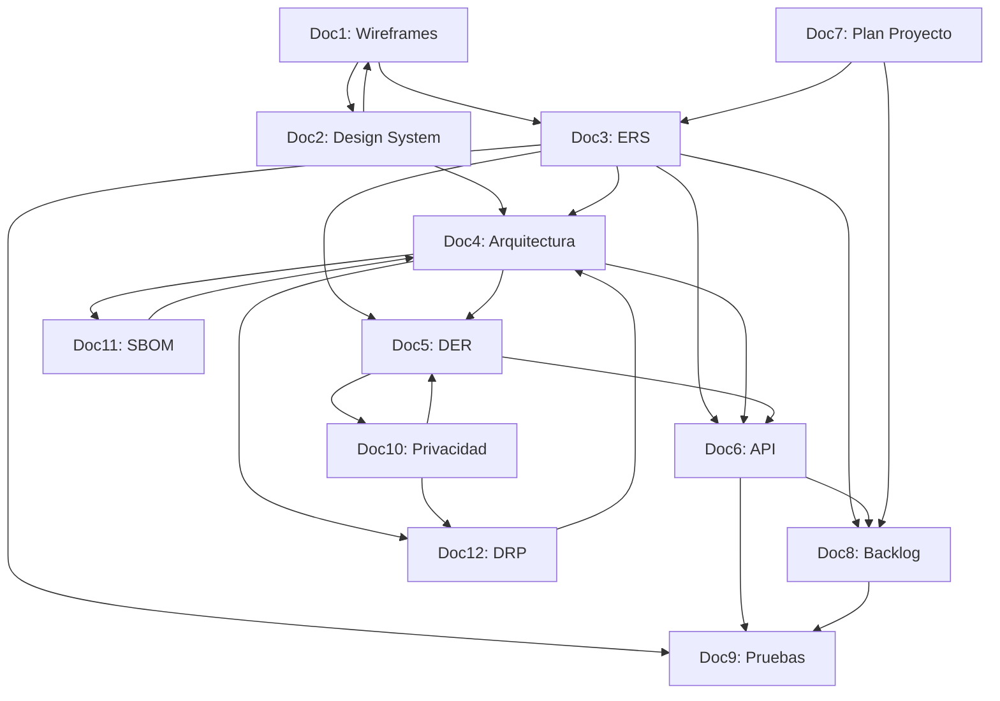

# Mapa Maestro CIVICUM

**Fecha:** 2026-01-28  
**Documentos analizados:** 12  
**Estado:** Solo lectura — fuente de verdad para dependencias cruzadas

---

## 1. Índice por Documento

### Doc1: Wireframes y Prototipos de Alta Fidelidad
[Ver documento](file:///c:/Users/daniel.aguirre/Proyectos/civicum/docs/official/CIVICUM_Doc1_Wireframes_Prototipos_Alta_Fidelidad.docx.md)

**Propósito:** Especificación de wireframes y prototipos UI para los 6 módulos MVP.

| Sección | Contenido |
|---------|-----------|
| 1. Resumen Ejecutivo | Alcance, metodología, módulos MVP |
| 2. Fundamentos de Diseño | Principios F-XX, contexto antropológico H-01 a H-09 |
| 3. Design System Terracota v2 | Paleta, tipografía, espaciado, iconografía |
| 4. Segmentos Usuarios S1-S6 | Perfiles y adaptaciones UX por segmento |
| 5. Wireframes por Módulo | Mi CIVICUM, Academia, Asistente, Alza la Voz, Cuentas Claras, Voto |
| 6-10. Flujos y Patrones | Flujos usuario, patrones UX, responsive, device tiers |
| 11-12. Validación | Archivos fuente, decisiones F-XX implementadas |

---

### Doc2: Sistema de Diseño y Guía de Estilo
[Ver documento](file:///c:/Users/daniel.aguirre/Proyectos/civicum/docs/official/CIVICUM_Doc2_Sistema_Diseno_Guia_Estilo.docx.md)

**Propósito:** Design System Terracota v2 completo — tokens, componentes y estándares visuales.

| Sección | Contenido |
|---------|-----------|
| Parte I: Fundamentos | Filosofía visual, paleta colores, tipografía, iconografía Lucide, espaciado |
| Parte II: Componentes | Botones, cards, formularios, navegación Smart Dock, feedback |
| Parte III: Sistemas | Accesibilidad WCAG, responsive 5 breakpoints, device tiers, PWA |
| Parte IV: Implementación | CSS tokens, guía integración, conexión decisiones F-XX |

---

### Doc3: ERS IEEE 830
[Ver documento](file:///c:/Users/daniel.aguirre/Proyectos/civicum/docs/official/CIVICUM_Doc3_ERS_IEEE_830.docx.md)

**Propósito:** Especificación de requisitos de software según estándar IEEE 830.

| Sección | Contenido |
|---------|-----------|
| 1. Introducción | Propósito, alcance, definiciones, referencias |
| 2. Descripción General | Perspectiva producto, funciones, usuarios, restricciones |
| 3.1 Requisitos Funcionales | RF por módulo: Mi CIVICUM, Academia, Asistente, Alza la Voz, Cuentas Claras, Voto |
| 3.2 Requisitos No Funcionales | Rendimiento, seguridad, usabilidad, confiabilidad, mantenibilidad |
| 3.3-3.4 Interfaces | APIs gubernamentales, servicios terceros, restricciones diseño |
| 4. Arquitectura Sistema | Stack tecnológico, IA 3 capas, offline-first |
| Anexos A-G | Trazabilidad, reglas negocio, edge cases, i18n, webhooks, algoritmos, compliance |

---

### Doc4: Arquitectura Software (SAD)
[Ver documento](file:///c:/Users/daniel.aguirre/Proyectos/civicum/docs/official/CIVICUM_Doc4_Arquitectura_Software_SAD.docx.md)

**Propósito:** Documento de arquitectura — stack zero-cost + IA distribuida.

| Sección | Contenido |
|---------|-----------|
| 1. Introducción | Propósito, alcance, referencias |
| 2. Visión Arquitectónica | Principios, modelo vistas 4+1 (lógica, proceso, desarrollo, física, escenarios) |
| 3. ADRs | Decisiones arquitectónicas: Neon.tech, Vercel, PWA, IA distribuida |
| 4. Stack Tecnológico | Frontend, backend, DB, IA (3 pisos), DevOps |
| 5. Patrones de Diseño | Arquitectónicos, frontend, backend |
| 6. Arquitectura Seguridad | Defensa profundidad, autenticación, protección datos, OWASP |

---

### Doc5: DER Modelo de Datos
[Ver documento](file:///c:/Users/daniel.aguirre/Proyectos/civicum/docs/official/CIVICUM_Doc5_DER_Modelo_Datos.docx.md)

**Propósito:** Modelo completo PostgreSQL — 57 tablas, 73 relaciones, 145 índices.

| Sección | Contenido |
|---------|-----------|
| 1-2. Introducción | Características modelo, estadísticas |
| 3. Organización Dominios | Usuarios, Alza la Voz, Cuentas Claras, Voto, Academia, Asistente |
| 4. Diagrama Conceptual | ERD simplificado |
| 5. Esquemas SQL | profiles, community_reports, authorities, authority_promises |
| 6. Matriz Relaciones | FKs y cascade policies |
| 7. Políticas RLS | Row Level Security por tabla |
| 8-11. Optimización | Índices, particionado, vistas materializadas, funciones, triggers |
| Anexos | Diccionario datos, nomenclaturas, métricas |

---

### Doc6: API Specification (OpenAPI 3.0)
[Ver documento](file:///c:/Users/daniel.aguirre/Proyectos/civicum/docs/official/CIVICUM_Doc6_API_Specification.docx.md)

**Propósito:** Especificación REST completa — endpoints por módulo.

| Sección | Contenido |
|---------|-----------|
| 1. Introducción | Base URL, convenciones, autenticación |
| 2. Autenticación | WebAuthn, Magic Links, JWT tokens |
| 3.1-3.6 Módulos API | Mi CIVICUM, Alza la Voz, Cuentas Claras, Voto, Academia, Asistente |
| 4. Esquemas Datos | User, Report, Pagination schemas |
| 5. Códigos Error | RFC 7807 Problem Details |
| 6. Rate Limiting | Límites por usuario e IP |

---

### Doc7: Plan de Proyecto Gantt
[Ver documento](file:///c:/Users/daniel.aguirre/Proyectos/civicum/docs/official/CIVICUM_Doc7_Plan_Proyecto_Gantt.docx.md)

**Propósito:** Roadmap 24 semanas MVP→V1→V2 con hitos y dependencias.

| Sección | Contenido |
|---------|-----------|
| 1. Resumen Ejecutivo | Info proyecto, objetivos, fases |
| 2. Cronograma Maestro | Sprint 0, MVP (S1-S5), V1 (S6-S12), V2 (S13-S20), Cierre (S21-S24) |
| 3. Hitos Críticos | Gates validación, entregables principales |
| 4. Dependencias | Diagrama, ruta crítica, tareas críticas |
| 5. Recursos | Equipo core, distribución por sprint |
| 6. Gestión Riesgos | Matriz riesgos, contingencias |
| 7. Estimaciones | Horas por fase, presupuesto infraestructura |

---

### Doc8: Backlog Gherkin (User Stories BDD)
[Ver documento](file:///c:/Users/daniel.aguirre/Proyectos/civicum/docs/official/CIVICUM_Doc8_Backlog_Gherkin.docx.md)

**Propósito:** 86 User Stories en formato Gherkin para 6 épicas MVP.

| Sección | Contenido |
|---------|-----------|
| 1. Introducción | Propósito, convenciones Gherkin |
| 2. Épica 1: Mi CIVICUM | US-001 a US-005: Registro, login, onboarding, perfil, niveles |
| 3. Épica 2: Alza la Voz | US-006 a US-008: Crear reporte, apoyar, seguimiento OIRS |
| 4. Épica 3: Academia | US-009 a US-010: Cápsulas, misiones |
| 5. Épica 4: Asistente | US-011 a US-012: Consultas Civia, generar documentos |
| 6. Épica 5: Cuentas Claras | US-013 a US-014: Promesas, presupuestos |
| 7. Épica 6: Voto Ciudadano | US-015 a US-017: Propuestas, votación, match democrático |

---

### Doc9: Plan de Pruebas y Validación
[Ver documento](file:///c:/Users/daniel.aguirre/Proyectos/civicum/docs/official/CIVICUM_Doc9_Plan_Pruebas_Validacion_COMPLETO.docx.md)

**Propósito:** Estrategia QA — 50+ casos E2E, WCAG, OWASP, performance.

| Sección | Contenido |
|---------|-----------|
| 1. Estrategia General | Pirámide testing, cobertura objetivo |
| 2. Casos E2E | Autenticación (10), Alza la Voz (15), Offline (8) |
| 3. Matriz Cobertura | Por módulo: unit, integration, E2E, a11y, security |
| 4. Accesibilidad | Herramientas automatizadas, casos manuales WCAG |
| 5. Seguridad | OWASP Top 10 |
| 6. Performance | Core Web Vitals, pruebas carga k6 |
| 7. Criterios Exit | Checklist obligatorio por sprint |

---

### Doc10: Política de Privacidad y Términos
[Ver documento](file:///c:/Users/daniel.aguirre/Proyectos/civicum/docs/official/CIVICUM_Doc10_Politica_Privacidad_Terminos.docx.md)

**Propósito:** Cumplimiento GDPR + Ley 19.628 Chile — derechos usuarios.

| Sección | Contenido |
|---------|-----------|
| Parte I: Privacidad | Principios, datos recopilados, niveles 0-3, finalidad, conservación, derechos, seguridad |
| 9. Medidas Seguridad | Técnicas (TLS, RLS, hashing) y organizativas (DPO, DPIA) |
| 10-14. Adicionales | Transferencias internacionales, cookies, menores, modificaciones |
| Parte II: Términos | Aceptación, uso aceptable, contenido, propiedad intelectual, limitaciones |

---

### Doc11: SBOM (Software Bill of Materials)
[Ver documento](file:///c:/Users/daniel.aguirre/Proyectos/civicum/docs/official/CIVICUM_Doc11_SBOM.docx.md)

**Propósito:** Inventario completo de 42 dependencias directas + 387 transitivas.

| Sección | Contenido |
|---------|-----------|
| Resumen | Estadísticas, criterios validación |
| Frontend | Framework, UI, PWA, IA local, formularios, mapas |
| Backend | Edge functions dependencies |
| Desarrollo | devDependencies |
| Análisis Licencias | 100% permisivas (MIT, Apache, ISC) |
| Vulnerabilidades | Estado Snyk/npm audit, política actualización |

---

### Doc12: DRP (Plan Recuperación Desastres)
[Ver documento](file:///c:/Users/daniel.aguirre/Proyectos/civicum/docs/official/CIVICUM_Doc12_DRP.docx.md)

**Propósito:** Disaster Recovery — RTO ≤4h, RPO ≤15min, disponibilidad ≥99.5%.

| Sección | Contenido |
|---------|-----------|
| Resumen | Objetivos RTO/RPO, alcance |
| Escenarios Desastre | D1-D8: Falla DB, CDN, DDoS, corrupción, etc. |
| Arquitectura Resiliencia | Stack redundante, SPOFs identificados |
| Estrategia Backups | DB (diario), storage, código fuente |
| Procedimientos | D1: Falla DB, D3: DDoS — pasos detallados |
| Roles | Cadena de mando, comunicación |
| Testing | Calendario, checklist mensual |

---

## 2. Mapa de Dependencias Cruzadas

### Diagrama de Dependencias

### Matriz de Dependencias por Tema

| Si cambia... | Revisar... | Razón |
|--------------|------------|-------|
| **Requisitos (Doc3)** | Doc4, Doc5, Doc6, Doc8, Doc9 | Requisitos afectan arquitectura, datos, API, historias y pruebas |
| **Arquitectura (Doc4)** | Doc5, Doc6, Doc11, Doc12 | Stack afecta modelo datos, API, dependencias y recuperación |
| **Modelo Datos (Doc5)** | Doc3, Doc6, Doc10 | Entidades afectan requisitos, endpoints y privacidad |
| **API (Doc6)** | Doc3, Doc5, Doc8, Doc9 | Endpoints deben reflejar requisitos, datos y ser probados |
| **Design System (Doc2)** | Doc1 | Cambios visuales afectan wireframes |
| **Wireframes (Doc1)** | Doc2, Doc3 | UI cambios pueden requerir actualizar sistema diseño o requisitos |
| **Backlog (Doc8)** | Doc7, Doc9 | User stories afectan cronograma y plan pruebas |
| **Privacidad (Doc10)** | Doc3, Doc5, Doc12 | Políticas datos afectan requisitos, modelo y DRP |
| **SBOM (Doc11)** | Doc4, Doc9 | Dependencias afectan arquitectura y seguridad |

---

## 3. Checklist de Consistencia Cruzada

> [!IMPORTANT]
> **Usar antes de aprobar cualquier PR documental.**

### A. Cambios en Requisitos Funcionales (Doc3)

- [ ] ¿Existe endpoint correspondiente en API (Doc6)?
- [ ] ¿Existe(n) tabla(s) en DER (Doc5) para soportar el requisito?
- [ ] ¿Existe User Story en Backlog (Doc8)?
- [ ] ¿Existen casos E2E en Plan Pruebas (Doc9)?
- [ ] ¿La arquitectura (Doc4) soporta el requisito?

### B. Cambios en Modelo de Datos (Doc5)

- [ ] ¿Los campos sensibles están documentados en Privacidad (Doc10)?
- [ ] ¿Existe endpoint API (Doc6) para CRUD de la entidad?
- [ ] ¿El ERS (Doc3) referencia esta entidad?
- [ ] ¿Las políticas RLS están definidas?
- [ ] ¿Hay migración documentada?

### C. Cambios en API (Doc6)

- [ ] ¿El endpoint está mapeado a requisito funcional (Doc3)?
- [ ] ¿Existe schema de datos en DER (Doc5)?
- [ ] ¿Hay caso E2E en Plan Pruebas (Doc9)?
- [ ] ¿El Backlog (Doc8) tiene historia para este endpoint?
- [ ] ¿Rate limiting y errores están especificados?

### D. Cambios en Arquitectura (Doc4)

- [ ] ¿SBOM (Doc11) refleja nuevas dependencias?
- [ ] ¿DRP (Doc12) cubre nuevos componentes?
- [ ] ¿DER (Doc5) está alineado con nuevo stack?
- [ ] ¿APIs (Doc6) usan tecnologías del stack?

### E. Cambios en UI/UX (Doc1, Doc2)

- [ ] ¿Design System (Doc2) tiene tokens necesarios?
- [ ] ¿Wireframes (Doc1) implementan Design System?
- [ ] ¿Requisitos usabilidad (Doc3) están cubiertos?
- [ ] ¿Accesibilidad WCAG está validada (Doc9)?

### F. Cambios en Privacidad/Seguridad (Doc10)

- [ ] ¿DER (Doc5) implementa retención de datos especificada?
- [ ] ¿ERS (Doc3) tiene requisitos de seguridad correspondientes?
- [ ] ¿DRP (Doc12) incluye procedimientos de brecha?
- [ ] ¿Plan Pruebas (Doc9) tiene casos OWASP?

### G. Cambios en Cronograma (Doc7)

- [ ] ¿Backlog (Doc8) está priorizado según nuevo timeline?
- [ ] ¿Dependencias entre tareas están actualizadas?
- [ ] ¿Recursos asignados son suficientes?

---

## 4. Resumen de Decisiones Clave (F-XX)

| Decisión | Descripción | Documentos que la implementan |
|----------|-------------|------------------------------|
| **F-02** | Honestidad Radical | Doc1, Doc2 |
| **F-04** | Construcción Secuencial | Doc3, Doc7 |
| **F-05** | Apartidismo Visual | Doc1, Doc2 |
| **F-07** | Offline Dignity | Doc3, Doc4 |
| **F-12** | Sistema IA 3 Capas | Doc3, Doc4 |
| **F-13** | Humanización | Doc1, Doc2 |
| **F-14** | Lenguaje Ciudadano | Doc1, Doc3 |
| **F-18** | Smart Dock | Doc1, Doc2 |
| **F-43** | Stack Zero-Cost | Doc3, Doc4, Doc11 |
| **F-44** | IA Distribuida Client-First | Doc3, Doc4 |
| **F-45** | Testing Obligatorio | Doc9 |

---

## 5. Módulos MVP y Documentos Relacionados

| Módulo | Req (Doc3) | Datos (Doc5) | API (Doc6) | UI (Doc1) | Backlog (Doc8) | Pruebas (Doc9) |
|--------|------------|--------------|------------|-----------|----------------|----------------|
| **Mi CIVICUM** | RF-MC-001 a 004 | profiles, user_* | /profile/* | MC-01 a 08 | US-001 a 005 | E2E-001 a 010 |
| **Academia Cívica** | RF-AC-001 a 004 | capsulas, user_progress | /capsulas/* | AC-01 a 10 | US-009 a 010 | ✓ Matriz |
| **Asistente Cívico** | RF-AS-001 a 004 | ai_conversations, templates | /assistant/* | - | US-011 a 012 | ✓ Matriz |
| **Alza la Voz** | RF-AV-001 a 004 | community_reports, mesas | /reports/* | - | US-006 a 008 | E2E-011 a 025 |
| **Cuentas Claras** | RF-CC-001 a 004 | authorities, promises, budget | /authorities/*, /budget/* | - | US-013 a 014 | ✓ Matriz |
| **Voto Ciudadano** | RF-VC-001 a 004 | proposals, proposal_votes | /proposals/* | - | US-015 a 017 | ✓ Matriz |

---

**Documento generado automáticamente**  
**Fuente:** 12 documentos en `docs/official/`  
**Uso:** Referencia para consistencia cruzada antes de PRs documentales
